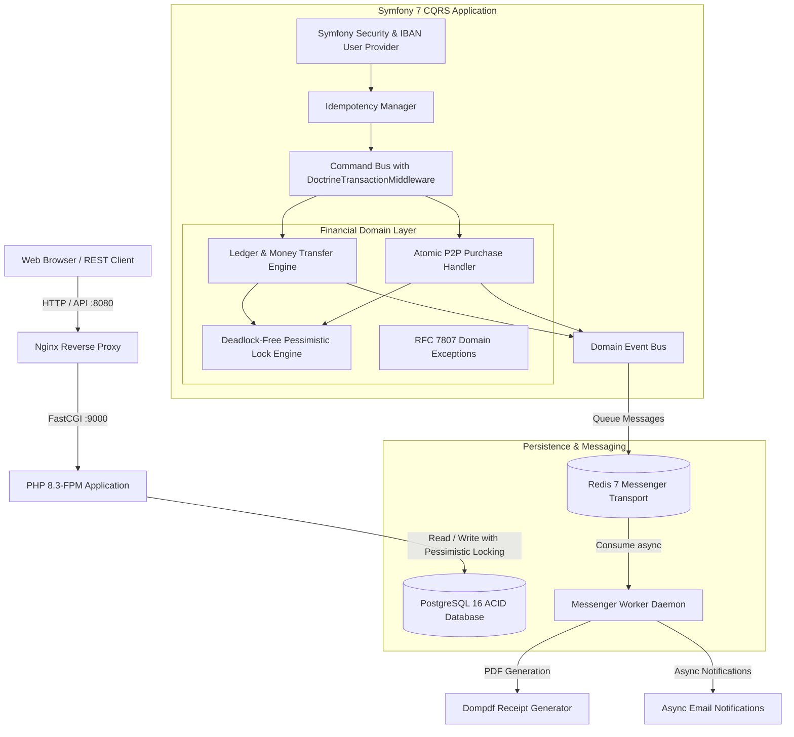

# 🛒 E-Commerce Micro-Marketplace (P2P Ledger & Commerce)

[](https://www.php.net/)
[](https://symfony.com/)
[](https://www.postgresql.org/)
[](https://redis.io/)
[](https://phpstan.org/)
[](https://cs.symfony.com/)
[](LICENSE)
[](https://codespaces.new/your-username/symfony-p2p-commerce?quickstart=1)

A production-grade **P2P Marketplace** with internal bank accounts, virtual balance management, and immutable double-entry ledger tracking. Designed specifically to showcase enterprise Symfony architecture, strict financial transactional safety, deadlock-free concurrency control, CQRS messaging buses, and asynchronous background worker pipelines.

---

## 🏛️ System Architecture



---

## 🌟 Key Architectural Patterns & Guarantees

### 1. Ledger Pattern (Immutable Double-Entry Ledger)
* Virtual balance is **never** incremented or decremented ad-hoc.
* Every balance mutation creates an immutable `Transaction` row recording:
  * `source_account_id` and `destination_account_id`
  * `amount` in minor currency units (cents)
  * `source_balance_after` and `destination_balance_after`
  * `type` (`DEPOSIT`, `TRANSFER`, `PURCHASE`, `SALE`)
  * `idempotency_key` and descriptive human/audit references.
* Money is represented by an immutable `Money` Value Object storing minor units (`int`), completely preventing floating-point rounding inaccuracies.

### 2. Concurrency Control & Deadlock Prevention
* Transfers acquire database-level **Pessimistic Write Locks** (`SELECT ... FOR UPDATE` via `LockMode::PESSIMISTIC_WRITE`).
* **Deterministic Lock Ordering**: When transferring between two accounts (Account A and Account B), account UUIDs are lexicographically sorted prior to acquiring locks:
  ```php
  $id1 = $source->getId()->toRfc4122();
  $id2 = $destination->getId()->toRfc4122();
  if (strcmp($id1, $id2) < 0) {
      $lockedSource = $em->find(Account::class, $source->getId(), LockMode::PESSIMISTIC_WRITE);
      $lockedDestination = $em->find(Account::class, $destination->getId(), LockMode::PESSIMISTIC_WRITE);
  } else {
      $lockedDestination = $em->find(Account::class, $destination->getId(), LockMode::PESSIMISTIC_WRITE);
      $lockedSource = $em->find(Account::class, $source->getId(), LockMode::PESSIMISTIC_WRITE);
  }
  ```
  This mathematically guarantees that cyclic `AB` vs `BA` deadlock conditions cannot occur under heavy concurrent load.

### 3. CQRS (Command Query Responsibility Segregation)
* Commands (`TransferFundsCommand`, `DepositFundsCommand`, `PurchaseProductCommand`, `CreateProductCommand`) are dispatched through `command.bus`.
* `DoctrineTransactionMiddleware` automatically wraps command executions in database transaction blocks, rolling back completely if any domain exception occurs.
* Separate `event.bus` handles domain events (`FundsTransferredEvent`, `ProductPurchasedEvent`).

### 4. Idempotency Keys (Replay Attack Prevention)
* Endpoints support the `Idempotency-Key` HTTP header.
* Tracks request payload hashes and statuses (`PROCESSING`, `COMPLETED`).
* A retried request with an identical key immediately returns the cached response with `X-Idempotent-Replayed: true` without double-debiting funds.
* Concurrent in-flight duplicates receive `409 Conflict`.

### 5. Domain Exceptions & RFC 7807
* Domain errors throw dedicated exceptions rather than generic ORM errors:
  * `InsufficientFundsException` (422 Unprocessable Entity)
  * `SelfTransferException` (422 Unprocessable Entity)
  * `InvalidAmountException` (400 Bad Request)
  * `AccountNotFoundException` (404 Not Found)
  * `ProductAlreadySoldException` (409 Conflict)
  * `IdempotencyConflictException` (409 Conflict)
* Formatted into standardized RFC 7807 `application/problem+json` details.

### 6. Asynchronous Background Queues (Symfony Messenger)
* Powered by **Redis 7** and consumed by a standalone `worker` container.
* `GenerateReceiptPdfMessage`: Worker asynchronously renders high-resolution PDF proof-of-payment receipts using Dompdf into `var/receipts/`.
* `SendPurchaseNotificationMessage`: Worker simulates notification delivery to buyer and seller upon order completion.

---

## 🌐 GitHub Codespaces (Zero-Install)

Click the badge above or use the button below to launch a **fully pre-configured cloud development environment** with all services running automatically.

[](https://codespaces.new/your-username/symfony-p2p-commerce?quickstart=1)

> 💡 Replace `your-username` in the badge URLs with your actual GitHub username.

### What happens automatically
When the Codespace starts, `.devcontainer/post-create.sh` runs and:
1. Installs all Composer dependencies
2. Waits for PostgreSQL to be ready
3. Runs all database migrations
4. Loads demo fixtures (Alice, Bob, Charlie, Admin)
5. Warms the Symfony cache

### Forwarded Ports
| Port | Service | Notes |
|---|---|---|
| **8080** | Web App (Nginx) | Opens automatically in browser |
| **5432** | PostgreSQL 16 | `app_user` / `app_password` |
| **6379** | Redis 7 | — |

### Running commands in Codespaces
Open the integrated terminal — it connects directly into the PHP container:
```bash
# All make targets work
make test
make phpstan
make fixtures
make migrate

# Or raw Symfony console commands
php bin/console debug:router
php bin/console messenger:consume async -vv
```

### Rebuilding the environment
If you change `Dockerfile` or `docker-compose.yml`, rebuild from the VS Code command palette:
> **Dev Containers: Rebuild Container**

---

## 🚀 Quick Start (Docker Compose)

### 1. Start the Containers
```bash
docker compose up -d
```

Services started:
* **Web UI & REST API**: [http://localhost:8080](http://localhost:8080)
* **PostgreSQL 16**: `localhost:5432` (`app_user` / `app_password`)
* **Redis 7**: `localhost:6379`
* **Worker**: Consuming from `async` queue

### 2. Apply Migrations & Seed Sample Data
```bash
docker compose exec php php bin/console doctrine:migrations:migrate -n
docker compose exec php php bin/console doctrine:fixtures:load -n
```

---

## 👥 Seeded Demo Accounts

| Account / Email | Password | Role | Initial Balance | Virtual IBAN |
|---|---|---|---|---|
| `alice@example.com` | `password123` | `ROLE_USER` | **$1,500.00** | `ECOMM-1111-2222-3333` |
| `bob@example.com` | `password123` | `ROLE_USER` | **$500.00** | `ECOMM-4444-5555-6666` |
| `charlie@example.com` | `password123` | `ROLE_USER` | **$250.00** | `ECOMM-7777-8888-9999` |
| `admin@example.com` | `password123` | `ROLE_ADMIN` | **$10,000.00** | `ECOMM-0000-0000-0001` |

> 💡 *Quick Login*: The sign-in page includes 1-click login buttons to easily test transfers and purchases between Alice and Bob.

---

## 📡 REST API Examples

### 1. Check Account Balance
```bash
curl -X GET "http://localhost:8080/api/v1/account/me?email=alice@example.com"
```
**Response (200 OK):**
```json
{
  "id": "01a0b3fd-4cca-7c96-924f-b41c17c7273c",
  "accountNumber": "ECOMM-1111-2222-3333",
  "email": "alice@example.com",
  "balance": 150000,
  "balanceFormatted": "$1500.00",
  "currency": "USD"
}
```

### 2. P2P Transfer (with Idempotency Key)
```bash
curl -X POST "http://localhost:8080/api/v1/account/transfer" \
  -H "Content-Type: application/json" \
  -H "Idempotency-Key: e7a35c10-9c2b-4fa8-bbf7-91542f49c001" \
  -d '{
    "from": "alice@example.com",
    "to": "bob@example.com",
    "amount": 50.00,
    "reference": "Design contract milestone"
  }'
```

### 3. Atomic P2P Product Purchase
```bash
curl -X POST "http://localhost:8080/api/v1/products/01a0b3fd-4ccb-798f-b597-f4513f21c7a6/buy" \
  -H "Content-Type: application/json" \
  -H "Idempotency-Key: purchase-key-002" \
  -d '{"buyerEmail": "alice@example.com"}'
```

### 4. Download PDF Transaction Proof
```bash
curl -O -J "http://localhost:8080/api/v1/transactions/<transaction-uuid>/receipt"
```

---

## 🧪 Automated Testing & Code Quality

### Run PHPUnit Test Suite
```bash
docker compose exec php bin/phpunit
```
Output:
```
OK (16 tests, 52 assertions)
```

### Run PHPStan Static Analysis (Level 8)
```bash
docker compose exec php vendor/bin/phpstan analyse -c phpstan.neon
```
Output:
```
[OK] No errors
```

### Run PHP-CS-Fixer (PSR-12 / Symfony Standard)
```bash
docker compose exec php vendor/bin/php-cs-fixer fix --dry-run --diff
```

---

## 🛠️ Makefile Commands

| Command | Description |
|---|---|
| `make up` | Start all Docker containers in the background |
| `make down` | Stop and remove containers |
| `make restart` | Restart containers |
| `make test` | Run PHPUnit test suite inside container |
| `make phpstan` | Run PHPStan analysis at Level 8 |
| `make cs-fix` | Automatically format code with PHP-CS-Fixer |
| `make migrate` | Run Doctrine database migrations |
| `make fixtures`| Reload sample fixture data |
| `make php` | Open interactive bash shell inside PHP container |
| `make worker` | View real-time logs from Symfony Messenger worker |
| `make logs` | View all container logs |
